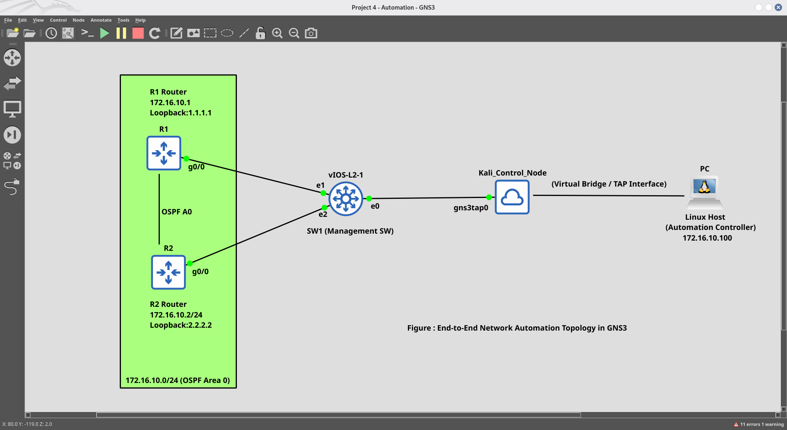

# Network Automation & Programmability Lab

[](https://www.python.org/)
[](https://www.ansible.com/)
[](https://www.cisco.com/)
[](https://www.kali.org/)
[](https://www.gns3.com/)

> 🚀 A comprehensive, multi-module NetDevOps framework for automating enterprise Cisco IOS network infrastructure using Python, Ansible, REST APIs, and Infrastructure as Code principles.

---

## 📖 Overview

This repository contains a **CCNA 200-301 Portfolio Project** demonstrating modern network automation and programmability concepts. The project integrates multiple automation technologies to eliminate manual network configuration, reduce operational bottlenecks, and implement Infrastructure as Code (IaC) best practices.

---

## 📁 Repository Structure (actual)

```text
Network-Automation-Programmability-Lab/
├── GNS3 Data/                          # GNS3 project files (directory)
├── Screenshots/                         # Execution proof images (directory)
├── Project 4: Network Automation & Programmability .md  # Detailed project document
├── README.md                            # This file
├── device_backup.py                     # Automated config backup (Netmiko)
├── config_push.py                       # Bulk config provisioning
├── json_yaml_automation.py              # JSON/YAML parsing & templates
├── json_to_config.py                    # Helper to render config from JSON
├── api_request.py                       # REST API examples
├── ansible_sim.py                       # Python wrapper / example for Ansible
├── sdn_architecture_check.py            # SDN audit/validation script
├── inventory.json                       # Device inventory (JSON)
├── config.yaml                          # Configuration template (YAML)
├── hosts                                # Ansible inventory file
├── site.yml                             # Ansible playbook
└── (other supporting files in repo root)
```

> Note: The repository keeps Python scripts at the repository root (not inside a "Python Scripts/" folder) and Ansible files (hosts, site.yml) at the root as well. The README previously described a different folder layout; this file has been updated so the structure shown matches the repository contents.

---

## 🌐 Network Topology

The lab features a GNS3-based network with:

- **Kali Linux Control Node** (`172.16.10.100`) - Automation engine
- **Router R1** (`172.16.10.1`, Loopback: `1.1.1.1`) - Cisco IOS
- **Router R2** (`172.16.10.2`, Loopback: `2.2.2.2`) - Cisco IOS
- **Management Switch** - Virtual switching fabric
- **OSPF Area 0** - Dynamic routing backbone



---

## 🛠️ Tech Stack

### Required Tools:

| Tool | Version | Purpose |
|------|---------|---------|
| **Python** | 3.10+ | Automation scripts |
| **Kali Linux** | 2026.x | Control node OS |
| **GNS3** | 2.2+ | Network simulation |
| **Cisco IOS** | 15.x/16.x | Target network OS |
| **Ansible** | 2.10+ | Configuration management |

### Python Libraries:

```bash
netmiko
pyyaml
requests
```

---

## 🚀 Quick Start

```bash
# Clone repository
git clone https://github.com/kamleshsande85/Network-Automation-Programmability-Lab.git
cd Network-Automation-Programmability-Lab

# Create Python virtual environment
python3 -m venv env
source env/bin/activate

# Install dependencies (if you add a requirements.txt)
# pip install -r requirements.txt
```

Update credentials in scripts (or use environment variables):

```bash
export ROUTER_USER=admin
export ROUTER_PASS=Cisco123!
```

Run example scripts from repository root:

```bash
python device_backup.py
python config_push.py
python json_yaml_automation.py
python api_request.py
python ansible_sim.py
python sdn_architecture_check.py
```

---

## 📚 Documentation

See the detailed project document:

📖 **[Project 4: Network Automation & Programmability .md](Project%204:%20Network%20Automation%20&%20Programmability%20.md)**

---

## 🤝 Contributing

Contributions are welcome — please open a pull request with changes.

---

## 📝 License

See repository files for license information.

---

## 👤 Author

**Kamlesh Kumar** — https://github.com/kamleshsande85
