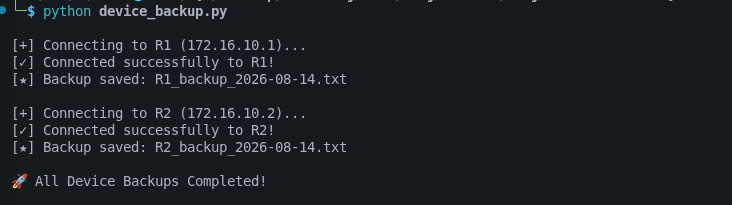
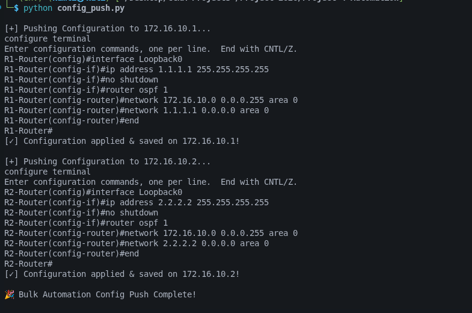
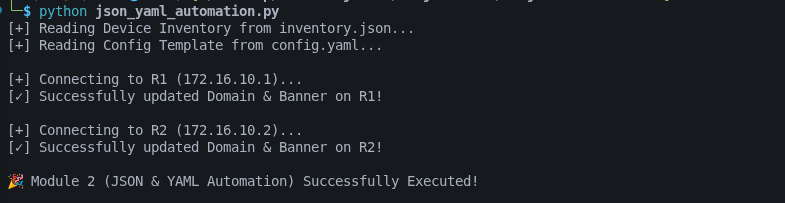
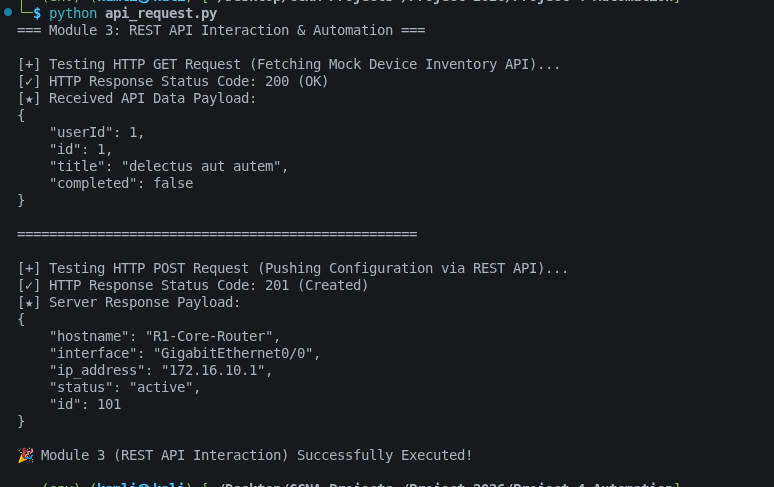
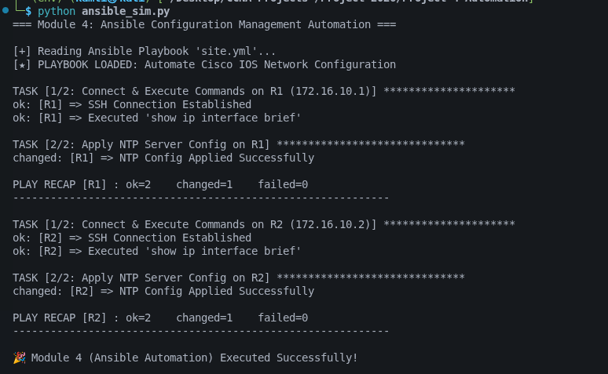
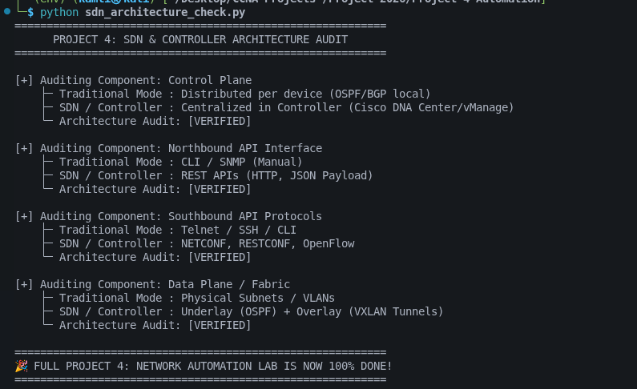

# Network Automation & Programmability Lab

[](https://www.python.org/)
[](https://www.ansible.com/)
[](https://www.cisco.com/)
[](https://www.kali.org/)
[](https://www.gns3.com/)
[](LICENSE)

> 🚀 A comprehensive, multi-module NetDevOps framework for automating enterprise Cisco IOS network infrastructure using Python, Ansible, REST APIs, and Infrastructure as Code principles.

---

## 📖 Overview

This repository contains a **CCNA 200-301 Portfolio Project** demonstrating modern network automation and programmability concepts. The project integrates multiple automation technologies to eliminate manual network configuration, reduce operational bottlenecks, and implement Infrastructure as Code (IaC) best practices.

### 🎯 Key Highlights

| Feature | Description |
|---------|-------------|
| **Python SSH Automation** | Netmiko-based device backup and bulk configuration deployment |
| **Data Serialization** | JSON inventories and YAML configuration templates |
| **REST API Integration** | HTTP GET/POST interactions with JSON payloads |
| **Ansible Orchestration** | Declarative playbooks for continuous compliance |
| **SDN Architecture** | Programmatic validation of Control/Data plane separation |
| **GNS3 Lab** | Complete network topology with Cisco IOS routers |

---

## 📁 Repository Structure

```text
Network-Automation-Programmability-Lab/
├── Screenshots/                          # Visual proof of execution
│   ├── 01_gns3_network_topology.png
│   ├── 02_python_device_backup.png
│   ├── 03_python_config_push.png
│   ├── 04_router-R1_ospf_neighbors.png
│   ├── 04_router-R2_ospf_neighbors.png
│   ├── 05_json_yaml_automation.png.png
│   ├── 06_rest_api_http_requests.png
│   ├── 07_ansible_playbook_execution.png
│   └── 08_sdn_architecture_audit.png
│
├── GNS3 Data/                            # GNS3 project files
│
├── Python Scripts/
│   ├── device_backup.py                  # Automated config backup
│   ├── config_push.py                    # Bulk config provisioning
│   ├── json_yaml_automation.py           # Data serialization demo
│   ├── api_request.py                    # REST API interaction
│   ├── ansible_sim.py                    # Ansible execution engine
│   └── sdn_architecture_check.py         # SDN audit verification
│
├── Ansible Components/
│   ├── hosts                             # Inventory file
│   └── site.yml                          # Playbook
│
├── Configuration Files/
│   ├── inventory.json                    # Device inventory
│   └── config.yaml                       # Config template
│
├── Project 4: Network Automation & Programmability .md  # Detailed documentation
├── README.md                              # This file
└── .gitignore

```

---

## 🌐 Network Topology

The lab features a GNS3-based network with:

- **Kali Linux Control Node** (`172.16.10.100`) - Automation engine
- **Router R1** (`172.16.10.1`, Loopback: `1.1.1.1`) - Cisco IOS
- **Router R2** (`172.16.10.2`, Loopback: `2.2.2.2`) - Cisco IOS
- **Management Switch** - Virtual switching fabric
- **OSPF Area 0** - Dynamic routing backbone

### Visual Topology:


---

## 🛠️ Tech Stack

### Required Tools:

| Tool | Version | Purpose |
|------|---------|---------|
| **Python** | 3.10+ | Automation scripts |
| **Kali Linux** | 2026.x | Control node OS |
| **GNS3** | 2.2+ | Network simulation |
| **Cisco IOS** | 15.x/16.x | Target network OS |
| **Ansible** | 2.10+ | Configuration management |

### Python Libraries:

```bash
netmiko==4.3.0      # SSH automation library
pyyaml==6.0         # YAML parser
requests==2.31.0    # HTTP client
```

---

## 🚀 Quick Start

### 1️⃣ Prerequisites

- GNS3 v2.2+ with Cisco IOS images configured
- Kali Linux running as a node in GNS3 with Python 3.10+
- SSH connectivity from Kali to routers on `172.16.10.0/24`

### 2️⃣ Installation

```bash
# Clone repository
git clone https://github.com/kamleshsande85/Network-Automation-Programmability-Lab.git
cd Network-Automation-Programmability-Lab

# Create Python virtual environment
python3 -m venv env
source env/bin/activate

# Install dependencies
pip install -r requirements.txt
```

### 3️⃣ Configuration

Update credentials in scripts (or use environment variables):

```bash
# Set credentials as environment variables
export ROUTER_USER=admin
export ROUTER_PASS=Cisco123!
```

### 4️⃣ Run Automation Pipeline

Execute modules in sequence:

```bash
# Module 1: Device Backup
python device_backup.py

# Module 2: Configuration Push (Loopback + OSPF)
python config_push.py

# Module 3: JSON/YAML Serialization
python json_yaml_automation.py

# Module 4: REST API Interaction
python api_request.py

# Module 5: Ansible Orchestration
python ansible_sim.py

# Module 6: SDN Architecture Audit
python sdn_architecture_check.py
```

---

## 📋 Module Details

### **Module 1: Python SSH Automation (Netmiko)**

Automates device connectivity and configuration:

- **device_backup.py** - Connects to routers, executes `show running-config`, saves timestamped backups
- **config_push.py** - Deploys Loopback interfaces and OSPF Area 0 configuration

**Execution Proof:**





---

### **Module 2: Data Serialization (JSON & YAML)**

Implements Infrastructure as Code principles:

- **inventory.json** - Device inventory with credentials
- **config.yaml** - Configuration templates for reusability
- **json_yaml_automation.py** - Parses and applies configurations

**Execution Proof:**



---

### **Module 3: REST API Interaction**

Demonstrates HTTP-based network programmability:

- **api_request.py** - Shows HTTP GET (200) and POST (201) requests
- Uses JSONPlaceholder API for testing

**Execution Proof:**



---

### **Module 4: Ansible Configuration Management**

Declarative orchestration of network devices:

- **hosts** - Ansible inventory with router details
- **site.yml** - Playbook for interface queries and NTP deployment
- **ansible_sim.py** - Python wrapper for playbook execution

**Execution Proof:**



---

### **Module 5: Software-Defined Networking (SDN) Audit**

Validates SDN architecture concepts:

- **sdn_architecture_check.py** - Audits Control/Data plane separation
- Verifies Northbound/Southbound API flows
- Validates Underlay/Overlay fabric design

**Execution Proof:**



---

## ✅ Verification Commands

### On Router R1/R2:

```bash
# Check Loopback configuration
show ip interface brief

# Verify OSPF neighbor adjacency
show ip ospf neighbor
show ip ospf database

# Check NTP configuration
show running-config | include ntp
```

**Verification Screenshots:**

- [Router R1 OSPF Neighbors](Screenshots/04_router-R1_ospf_neighbors.png)
- [Router R2 OSPF Neighbors](Screenshots/04_router-R2_ospf_neighbors.png)

---

## 🎓 Learning Outcomes

By working through this lab, you'll gain proficiency in:

✅ **Python Network Automation** - Netmiko SSH connectivity and device automation  
✅ **Infrastructure as Code (IaC)** - JSON/YAML for configuration management  
✅ **REST API Development** - HTTP requests and JSON payload handling  
✅ **Ansible Playbooks** - Declarative network orchestration  
✅ **SDN Concepts** - Control/Data plane separation and API interactions  
✅ **GNS3 Simulation** - Lab environment design and management  

---

## 📊 Project Statistics

| Metric | Value |
|--------|-------|
| **Python Scripts** | 6 modules |
| **Configuration Files** | 3 files (JSON, YAML, INI) |
| **Automation Modules** | 5 (Python, Ansible, REST, SDN) |
| **Network Devices** | 2 Cisco IOS routers |
| **Execution Screenshots** | 8 proof images |
| **Code Lines** | 500+ |

---

## 🔧 Troubleshooting

### Common Issues:

| Issue | Solution |
|-------|----------|
| **SSH Connection Failed** | Verify router IPs, credentials, and management network connectivity |
| **Netmiko Import Error** | Reinstall: `pip install --upgrade netmiko` |
| **Ansible Connection Timeout** | Check network_cli connection plugin: `ansible-galaxy collection install cisco.ios` |
| **GNS3 Topology Not Starting** | Ensure sufficient RAM (8GB+) and verify image paths |

### Debug Mode:

Enable verbose output in Python scripts:

```python
from netmiko import ConnectHandler
net_connect = ConnectHandler(..., verbose=True)
```

---

## 📚 Documentation

Full detailed documentation is available in:

📖 **[Project 4: Network Automation & Programmability .md](Project%204:%20Network%20Automation%20&%20Programmability%20.md)**

This file contains:
- Comprehensive module breakdown
- Complete code listings
- Network design details
- IP addressing plan
- Visual portfolio with embedded screenshots

---

## 🤝 Contributing

Contributions are welcome! To contribute:

1. Fork the repository
2. Create a feature branch (`git checkout -b feature/amazing-feature`)
3. Commit your changes (`git commit -m 'Add amazing feature'`)
4. Push to the branch (`git push origin feature/amazing-feature`)
5. Open a Pull Request

---

## 📝 License

This project is licensed under the MIT License - see the [LICENSE](LICENSE) file for details.

---

## 👤 Author

**Kamlesh Kumar**

- GitHub: [@kamleshsande85](https://github.com/kamleshsande85)
- Email: kamleshsande85@gmail.com

---

## 🏆 Project Status

✅ **COMPLETE & VERIFIED**

- All 5 automation modules implemented
- Network topology tested and validated
- Visual proof screenshots captured
- Documentation complete

Last Updated: **August 2026**

---

## 📮 Support & Questions

For questions, issues, or suggestions:

1. Check the **[Project Documentation](Project%204:%20Network%20Automation%20&%20Programmability%20.md)**
2. Review the **Screenshots** folder for execution proof
3. Open an **GitHub Issue** for bug reports
4. Create a **Discussion** for general questions

---

## 🙏 Acknowledgments

- Cisco Learning Network for CCNA 200-301 curriculum
- GNS3 community for simulation platform
- Netmiko project for SSH automation
- Ansible community for orchestration framework

---

## 📞 Contact & Social

Connect with me on:
- **GitHub**: [kamleshsande85](https://github.com/kamleshsande85)
- **LinkedIn**: [Coming Soon]
- **Twitter**: [Coming Soon]

---

## ⭐ If you found this helpful, please consider giving it a star! ⭐

